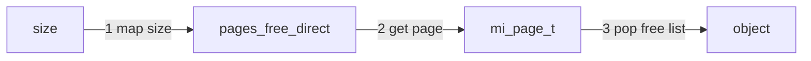
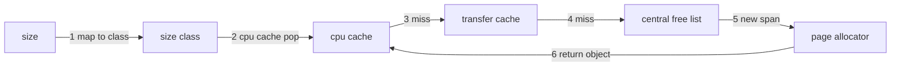

# mimalloc vs tcmalloc 实现对比：结构关系、分配与回收

面向开发者。本篇按“结构关系 → 数据流 → 回收与 RSS → 碎片化 → trade‑off”的顺序组织，力求像技术书籍一样连贯叙述，而不是简单列举参数与路径。所有关键结论均可在 Code Index 中找到对应源码行号。

Code snapshot：
- mimalloc: `tmp/mimalloc/` git describe `v2.2.7-9-gb69f9cb3`
- tcmalloc: `tmp/tcmalloc/` git describe `47a88fac`

---

## 1. 术语与核心定义

这两套 allocator 都在“虚拟地址空间”上开疆拓土，但掌控方式不同：mimalloc 更像是“自己记账并控制 commit”，tcmalloc 更像是“依赖 OS 按需提交并用 madvise 回收”。以下术语用于统一描述。

- Reserve: 向 OS 预留大块虚拟地址空间
- Commit / Decommit: 虚拟页是否映射到物理内存
  - mimalloc: commit mask 显式跟踪与执行
  - tcmalloc: 依赖 OS 按需提交 + madvise/munmap 归还
- Container: allocator 级别的回收粒度
  - mimalloc: page（由 1..N 个 slice 组成）
  - tcmalloc: span（由若干 tcmalloc page 组成）
- Owner: 容器级别归属
  - mimalloc: page 归属某个 heap/thread
  - tcmalloc: object 无 owner，span 由 central/pageheap 管理
- Cache: 快路径缓存层
  - mimalloc: page freelist
  - tcmalloc: per‑CPU / ThreadCache / TransferCache

---

## 2. mimalloc：结构关系与数据流

### 2.1 结构关系图（字符画）

```
mimalloc
  segment (32MiB)
    └─ slices (64KiB)
         └─ page (1..N slices)
              └─ size class (page->block_size 固定)
                   └─ blocks (objects)
```

### 2.2 结构解释

mimalloc 的世界从 **segment** 开始。它先在虚拟地址空间中预留一个 32MiB 的段，然后把段切成 64KiB 的 slice。page 是 slice 的组合体，page 上的 `block_size` 固定，于是 page 就天然“绑定”了一个 size class。对象（block）从 page 的 freelist 弹出，page 为空时才能走回收路径。

- segment / slice / page 的尺寸：`MI_SEGMENT_SIZE=32MiB`，`MI_SEGMENT_SLICE_SIZE=64KiB`，small page = 64KiB，medium page = 512KiB
- commit 粒度：`MI_COMMIT_SIZE == MI_SEGMENT_SLICE_SIZE`，commit mask 在 slice 粒度上记账
- page 与 size class：`mi_page_t::block_size` 固定，page 队列按 size class 管理

### 2.3 分配数据流（快路径）

mimalloc 的分配路径极短：
1) 根据 size 直接落到 `pages_free_direct`；
2) 拿到 page 后从 freelist pop 一个对象。



### 2.4 free 与跨线程回收

mimalloc 的关键设计是 **owner page**。page 的 freelist 只由 owner 线程维护，跨线程 free 不能直接触碰 freelist，于是走“原子挂链 + 延迟合并”的路径：


这解释了 mimalloc 的低延迟：跨线程 free 只是一次 CAS，真正的合并留给 owner 在合适时机完成。

### 2.5 OS 归还路径

page 空了只是“可回收”，但不必然立即归还 OS。mimalloc 会标记 purge，再在 collect 阶段真正触发 decommit/madvise。这一延迟是稳定性与 RSS 回落速度之间的权衡。

### 2.6 锁粒度与冷启动

- 快路径几乎无锁：`mi_heap_t` 是线程私有结构
- 跨线程 free 用 CAS，不进入锁
- 真正需要锁的路径集中在 abandoned 段回收

### 2.7 RSS 行为与默认参数（确认默认值）

mimalloc 的 RSS 回落慢，更像是“刻意延迟”，而不是设计失误。它用参数把“稳定”和“回落”拉到一个可调的平衡点。以下是影响 RSS 的关键默认值与后果：

- `purge_delay` 默认 10ms：purge 延迟触发，RSS 回落更慢，但减少频繁 decommit 抖动
- `purge_decommits` 默认 1：purge 采用 decommit（Linux 上 MADV_DONTNEED），有利于回落，但依赖 OS 的实际回收时机
- `eager_commit` 默认 1，`eager_commit_delay` 默认 1（NetBSD 为 0）：前 N 个 segment 不 eager commit，降低启动期 RSS 峰值，之后更偏向“先提交再分配”
- `arena_purge_mult` 默认 10：arena 相关 purge 延迟更长，RSS 回落更慢
- `generic_collect` 默认 10000：collect 频率影响延迟 free 合并与 purge 的推进速度

补充说明：

- eager_commit / eager_commit_delay 的关系  
  eager_commit=1 意味着新 segment 会被“整段提交”，而 eager_commit_delay=N 会让**每线程前 N 个 segment**跳过整段提交，改为“按 page 需求提交”。  
  结果是：冷启动阶段 RSS 峰值更低（因为前 N 个 segment 不整段提交），但在第 N+1 个 segment 开始更倾向“先提交再分配”，RSS 增长更快、抖动更少。

- arena_purge_mult  
  arena 上的 purge_delay 会乘以该倍数。比如 purge_delay=10ms、arena_purge_mult=10，则 arena 内存的 purge 会延后到 100ms 量级。  
  结果是：arena 内存更不容易被快速回收，RSS 回落更慢，但可以减少频繁 decommit 带来的抖动。

- generic_collect  
  这是“慢路径分配”触发的收集节奏计数器：每发生 N 次 generic 分配，会触发一次 collect。  
  collect 会合并延迟 free（xthread_free / thread_delayed_free）并推动 purge 的执行时机。  
  结果是：N 越大，合并与 purge 越滞后，RSS 回落更慢但分配路径更轻；N 越小，回收更积极但有额外维护成本。

这些默认值共同塑造了“RSS 下降慢但延迟稳定”的体验。若目标是更快回落，可优先缩短 `purge_delay`，并提高 collect 频率。

---

## 3. tcmalloc：结构关系与数据流

### 3.1 结构关系图（字符画）

```
tcmalloc
  virtual region (mmap + mprotect)
    └─ page heap / hugepage allocator
         └─ span (N * tcmalloc page)
              └─ size class (span 内切 block)
                   └─ blocks (objects)

  caches
    └─ per-CPU cache
         └─ thread cache
              └─ transfer cache
                   └─ central freelist
```

### 3.2 结构解释

tcmalloc 的核心容器是 **span**。span 由若干 tcmalloc page 组成，page 大小由编译期 `TCMALLOC_PAGE_SHIFT` 决定（4K / 8K / 32K / 256K 可选，常见 8KiB）。span 在 central freelist 与 pageheap 之间流动，而对象由 span 内切割出来。

### 3.3 分配数据流（快路径）

tcmalloc 的快路径并不靠单一 freelist，而是靠“多级 cache”吸收竞争：



### 3.4 free 与跨线程回收

tcmalloc 不绑定 object owner。对象 free 时直接回到当前线程的 cache；cache 溢出再批量回流到 transfer/central freelist。这个设计让跨线程 free 更直接，但对象在 CPU 之间流动更频繁。


### 3.5 OS 归还路径

tcmalloc 的 OS 归还通常依赖后台动作：pageheap/hugepage allocator 选择可释放区间，再由 `ReleasePages` 调用 madvise。若没有后台驱动或 release rate 为 0，则回收节奏会明显放缓。

### 3.6 锁粒度与冷启动

- CentralFreeList 为每个 size class 一把锁
- PageHeap 由全局 `pageheap_lock` 保护
- 冷启动时 cache 为空，分配更容易穿透到 CentralFreeList 与 PageHeap，因此锁竞争更集中

### 3.7 后台释放语义

tcmalloc **不会自动创建后台线程**。默认只是把 background actions 标记为 enabled，真正的周期性释放需要外部线程调用 `ProcessBackgroundActions()`。如果没有驱动线程，释放会退化为“只在显式调用释放 API 时发生”。

### 3.8 RSS 行为与默认参数（确认默认值）

tcmalloc 的默认策略更偏向“RSS 增长慢、回落更快”，但前提是后台动作被驱动。

- `background_process_actions_enabled` 默认 true，但不会自动起线程
- `background_process_sleep_interval` 默认 1s
- `background_release_rate` 默认 0：即使后台动作被调用，也不会按速率持续释放大量页面
- `release_pages_from_huge_region` 默认 true：即使 release rate 为 0，也可能释放 huge region 中的可释放页

补充说明：

- background_release_rate 为 0 的含义  
  这不是“禁止释放”，而是“不做持续、按速率的释放”。也就是说：即使后台动作被调用，pageheap 也不会按固定带宽持续把大量页面归还给 OS；释放节奏更“保守”。  
  结果是：RSS 回落不会呈现稳定线性下降，而是更多依赖其它触发点。
- background_release_rate 为非 0 的含义  
  这是“目标释放速率”，单位为 bytes/second。后台动作每次运行时，会按时间间隔计算本次释放目标：  
  `bytes_to_release = rate * (now - prev_time)`  
  然后尝试在可释放页中归还这部分字节数。  
  这是一种节流机制：让回收以更平滑的速率推进，避免一次性释放造成抖动。
- release_pages_from_huge_region 的意义  
  huge region 是 tcmalloc 管理大块虚拟内存/hugepage 的区域，即使 release rate 为 0，也允许从 huge region 中释放“已空闲且可归还”的页面。  
  结果是：即便没有持续释放速率，某些巨页区域仍可能被回收，从而看到 RSS 在“空闲期”有小幅回落。

这解释了“RSS 回落更快”的常见体验：tcmalloc 的多级 cache 在空闲时会被回收，pageheap/hugepage 的释放也更积极，但只有在后台动作被驱动时才会持续发生。

---

## 4. 碎片化单独分析

### 4.1 碎片化层次（含具体例子）

- Internal fragmentation: size class 对齐浪费  
  例：申请 30B，落到 32B size class，浪费 2B
- Container slack: 容器尾部剩余空间  
  例：容器 64KiB，block 24B，能放 2730 个，剩余 16B 无法使用
- External fragmentation: 容器内仍有 live object  
  例：page/span 只剩 1 个 live object，其它全 free，整页仍无法回收
- Hugepage fragmentation: free pages 在 hugepage 内分散  
  例：2MiB hugepage 被切成 512 个 4KiB 页，空闲页分散，无法整体回收

### 4.2 mimalloc 碎片化

mimalloc 的外部碎片主要体现在“page 内仍有 live object”造成 page 无法回收；slice/segment 粒度下的碎片决定了 purge 是否能真正回落 RSS。

### 4.3 tcmalloc 碎片化

tcmalloc 的外部碎片更多体现为 span 尾部 slack 与 hugepage 内分散；subrelease 机制试图缓解巨大页碎片，但仍受分配模式影响。

### 4.4 对比表

| 维度 | mimalloc | tcmalloc |
| --- | --- | --- |
| internal | size class 对齐 | size class 对齐 |
| container | page 内 block 切分 | span 尾部 slack |
| external | page 内 live object pin | span 内 live object pin |
| hugepage | segment slice 粒度 | hugepage subrelease 模型 |

---

## 5. 场景分析：多线程突发分配 + cache miss

### 5.1 场景假设

- 多线程并发，线程 A 先进行一段“高占用”的大分配（含 large / huge 尺寸）
- 随后线程 B 才开始密集分配，且本地 cache 大概率为空（cold start），cache miss 很多

### 5.2 mimalloc 会发生什么

1) **B 的快路径仍是 thread‑local**  
   先走 `pages_free_direct`；若该 size class 没有空 page，会走 `mi_find_free_page` → `mi_page_fresh_alloc`，直接拿新 page/segment。

2) **A 的大分配被隔离到 large / huge page**  
   只要 `size > MI_MEDIUM_OBJ_SIZE_MAX`（64KiB）或对齐过大，就会走 `mi_large_huge_page_alloc`，通常分配独立 page/segment。  
   这类分配不会消耗 B 的 freelist，也不会占用 B 的 page queue。

3) **争用集中在“段分配/OS commit”而不是 allocator 热路径**  
   线程间几乎不共享 heap；真正可能有锁竞争的点主要是 segment/abandoned 回收路径与 OS commit。

**直观结果**：即使 B cache miss 很多，它的慢路径更多是“拿新 page/segment + commit”，而不是在多级 cache 与全局锁之间反复穿透。

### 5.3 tcmalloc 会发生什么

1) **B 在 cold start 下会穿透多级缓存**  
   `CpuCache miss → TransferCache miss → CentralFreeList`（per‑size‑class lock）→ `PageHeap`（全局 `pageheap_lock`）拿新 span。

2) **A 的大分配与 B 的 span 获取共享全局锁**  
   `size > kMaxSize`（本 snapshot 通常为 256KiB，取决于 `TCMALLOC_PAGE_SHIFT` 等配置）会走 `do_malloc_pages` / page allocator，  
   这与 B 的 span refill 竞争同一把 `pageheap_lock`。

3) **同核/同 CPU 下更容易放大抖动**  
   per‑CPU cache 共享导致同一 CPU 上的线程更容易出现互相“抢 cache”，cache miss 会更频繁。

**直观结果**：在“冷 cache + 大分配并行”的短窗口里，tcmalloc 的 miss 成本更高、全局锁争用更明显。

### 5.4 该场景下 mimalloc 往往更快的原因

- **路径短**：mimalloc 的慢路径更像“直接拿新 page/segment”，而不是多级 cache refill。  
- **隔离强**：大分配更容易被隔离，不会打乱其它线程的小对象 freelist。  
- **锁更少**：tcmalloc 的 central/pageheap 是热点；mimalloc 的 hot path 近乎无锁。

### 5.5 何时 tcmalloc 可能不吃亏

- size class 已经“热”，CpuCache 命中率高  
- 线程分布在不同 CPU，且大分配阶段已经结束  
- cache 容量足够大，refill 频率显著降低

---

## 6. 关键 trade‑off 总结

### 6.1 快路径命中与缓存策略对比

tcmalloc 的快路径依赖 cache 命中率，但它不是把性能赌在单层 cache 上：
- per‑CPU / thread / transfer 多级 cache 吸收争用，miss 时逐级回退到 central/pageheap。  
- 批量转移与动态 cache 调节让命中率在高并发下仍能维持。  

mimalloc 没有显式多级 cache，但 page 本身就是“隐式 cache”：
- `pages_free_direct` 直接给出“最合适的 page”，避免在队列里扫描。  
- page freelist 本身是对象缓存，page queue 维持线程局部性。  
- page 退休策略（retire cycles）避免热页被过早回收，从而提高“下一次仍命中 page 的概率”。  

结论上看：tcmalloc 用“多级 cache 策略”换命中率，mimalloc 用“page 保留策略”换命中率。

### 6.2 对比表

| 维度 | mimalloc | tcmalloc |
| --- | --- | --- |
| 结构核心 | page + freelist | span + 多级 cache |
| 跨线程 free | 送回 owner，再合并 | 就地回收到当前 cache |
| OS 归还 | commit mask + purge | background release + madvise |
| 锁粒度 | 热路径无锁 | per‑size‑class lock + pageheap_lock |
| commit 模型 | 显式 commit / decommit | OS 按需提交 + madvise |

---

## 7. Code Index

### 7.1 mimalloc

- `tmp/mimalloc/include/mimalloc/types.h:173-205`
  - segment / slice / page 尺寸定义
- `tmp/mimalloc/include/mimalloc/types.h:321-350`
  - `mi_page_t` 元数据（used / free / xthread_free）
- `tmp/mimalloc/include/mimalloc/types.h:378-392`
  - commit mask 与 `MI_COMMIT_SIZE`
- `tmp/mimalloc/include/mimalloc/types.h:522-557`
  - `mi_heap_t` 线程私有结构
- `tmp/mimalloc/include/mimalloc/types.h:589-596`
  - abandoned 段列表锁
- `tmp/mimalloc/include/mimalloc/internal.h:515-520`
  - `pages_free_direct` 入口
- `tmp/mimalloc/src/page-queue.c:173-213`
  - `pages_free_direct` 更新逻辑
- `tmp/mimalloc/src/alloc.c:31-46`
  - `_mi_page_malloc_zero` fast path
- `tmp/mimalloc/src/free.c:215-248`
  - 跨线程 free 的 CAS 合并入口
- `tmp/mimalloc/src/page.c:457-507`
  - page 退休（retire cycles）与延迟回收
- `tmp/mimalloc/src/segment.c:554-615`
  - purge 标记与触发
- `tmp/mimalloc/src/os.c:542-563`
  - OS purge
- `tmp/mimalloc/include/mimalloc.h:372-389`
  - purge / eager commit 参数语义
- `tmp/mimalloc/src/options.c:60-65`
  - `MI_DEFAULT_EAGER_COMMIT` 默认值
- `tmp/mimalloc/src/options.c:140-145`
  - `eager_commit_delay` 与 `purge_delay` 默认值
- `tmp/mimalloc/src/options.c:124-128`
  - `purge_decommits` 默认值
- `tmp/mimalloc/src/options.c:152-154`
  - `arena_purge_mult` 默认值
- `tmp/mimalloc/src/options.c:169-170`
  - `generic_collect` 默认值

### 7.2 tcmalloc

- `tmp/tcmalloc/tcmalloc/common.h:120-212`
  - `kPageShift` / `kPageSize`
- `tmp/tcmalloc/tcmalloc/common.h:301-314`
  - 全局 `pageheap_lock`
- `tmp/tcmalloc/tcmalloc/span.h:83-115`
  - Span 与 allocated 计数
- `tmp/tcmalloc/tcmalloc/cpu_cache.h:760-800`
  - CpuCache fast path
- `tmp/tcmalloc/tcmalloc/thread_cache.h:223-235`
  - ThreadCache freelist pop
- `tmp/tcmalloc/tcmalloc/central_freelist.h:111-139`
  - CentralFreeList per size‑class lock
- `tmp/tcmalloc/tcmalloc/central_freelist.h:576-682`
  - span 生成与回收
- `tmp/tcmalloc/tcmalloc/transfer_cache_internals.h:84-170`
  - TransferCache 批量回流
- `tmp/tcmalloc/tcmalloc/background.cc:31-199`
  - 后台释放路径
- `tmp/tcmalloc/tcmalloc/huge_page_aware_allocator.h:1014-1046`
  - ReleaseAtLeastNPages
- `tmp/tcmalloc/tcmalloc/internal/system_allocator.h:342-365`
  - virtual region 与 mprotect
- `tmp/tcmalloc/tcmalloc/internal/system_allocator.h:837-914`
  - ReleasePages 与 madvise
- `tmp/tcmalloc/tcmalloc/parameters.cc:72-92`
  - background actions 默认 enable 与 sleep interval
- `tmp/tcmalloc/tcmalloc/parameters.cc:168-171`
  - `background_release_rate` 默认值
- `tmp/tcmalloc/tcmalloc/parameters.cc:182-184`
  - `release_pages_from_huge_region` 默认值
- `tmp/tcmalloc/docs/tuning.md:123-125`
  - `ProcessBackgroundActions` 需要外部线程调用
