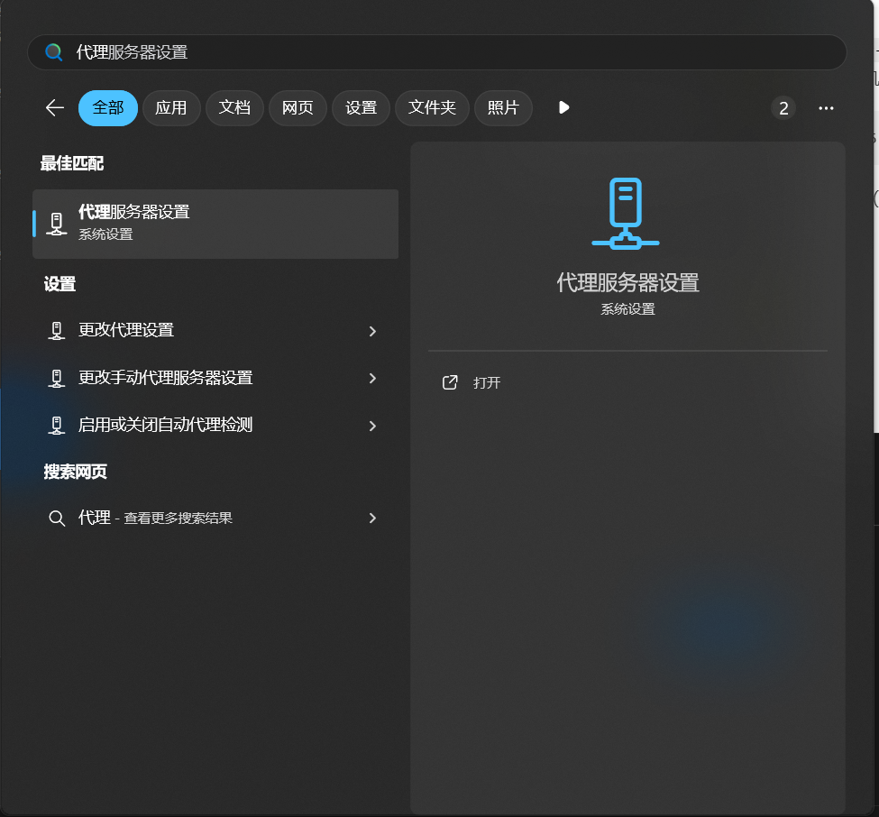
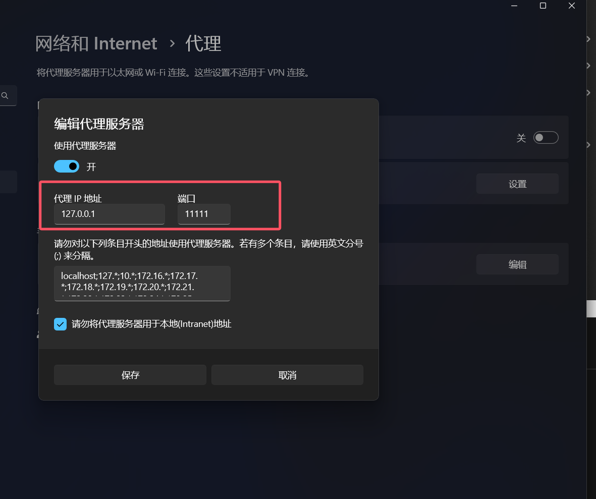

# Client Usage

## Quick Start

1. Download `http-proxy-cli` from [releases](https://github.com/acking-you/proxy-everything/releases) (choose your platform)
2. Run: `http-proxy-cli -s <server-ip> -c <local-port> --set-system-proxy`
3. Done! The `--set-system-proxy` flag auto-configures your OS proxy.

Without `--set-system-proxy`, manually configure system proxy to `127.0.0.1:<local-port>`.

## CLI Options

| Option | Description |
|--------|-------------|
| `-s, --server-host` | Server IP/domain (required) |
| `-c, --client-port` | Local port (default: 1080) |
| `-p, --server-port` | Server port (default: 1081) |
| `-k, --key` | 32-byte encryption key |
| `--set-system-proxy` | Auto-set OS proxy (Linux/macOS/Windows) |
| `--reverse-geo` | Reverse geo logic: proxy CN, direct others |
| `-m, --msg-key` | Enable random message key |

---

## SOCKS5 UDP ASSOCIATE

`http-proxy-cli` accepts RFC 1928 UDP associations on the same local port used
for HTTP and SOCKS5 TCP. The SOCKS5 control connection stays on TCP while the
client is given a temporary UDP relay address.

There is no additional UDP command-line option. Configure the application to
use `127.0.0.1:<client-port>` as a SOCKS5 proxy and enable UDP in that
application. A minimal flow is:

```text
Application -- SOCKS5 UDP --> http-proxy-cli
            -- framed tunnel --> http-proxy-server -- UDP --> destination
```

Operational details:

- Client and server must both contain UDP-association support. Older servers
  cannot interpret the new `udp_associate` transport header.
- UDP always uses the configured remote proxy server. TCP keyword/GeoIP split
  routing is not applied per UDP datagram.
- `--msg-key` enables AES-256-GCM authentication and encryption per UDP frame.
- `socks5://` and `socks5h://` upstream proxies support UDP ASSOCIATE when the
  upstream server implements it. `socks5://` resolves domain targets locally;
  `socks5h://` sends domain names to the upstream proxy.
- HTTP CONNECT upstream proxies do not support UDP.
- RFC 1928 fragmentation is not reassembled. Packets with `FRAG != 0` are
  dropped to keep association memory bounded.
- The UDP client address is pinned to the TCP control peer and the first valid
  UDP endpoint, preventing the local relay from becoming an open UDP proxy.
- Associations close with their TCP control connection and also expire after
  300 seconds without traffic. Set `UDP_ASSOCIATION_IDLE_TIMEOUT_SECS` on both
  sides to change the timeout.
- System HTTP proxy settings, including `--set-system-proxy`, do not capture UDP
  automatically. Use an application with SOCKS5 UDP support or a TUN adapter
  that emits SOCKS5 UDP ASSOCIATE.

---

## Windows

1. Download `http-proxy-cli-*-x86_64-pc-windows-msvc.zip` from [releases](https://github.com/acking-you/proxy-everything/releases)

2. Extract and open Command Prompt in that directory:
   ```cmd
   .\http-proxy-cli.exe -s YOUR_SERVER_IP -c 7890 --set-system-proxy
   ```

3. (With `--set-system-proxy`) System proxy is auto-configured. Skip to step 5.

4. (Without `--set-system-proxy`) Configure system proxy manually:
   - Open Settings → Network & Internet → Proxy
   - Enable "Use a proxy server"
   - Address: `127.0.0.1`, Port: `7890`

   
   

5. (Optional) Create `start_proxy.bat` for quick launch:
   ```bat
   @echo off
   http-proxy-cli.exe -s YOUR_SERVER_IP -c 7890
   pause
   ```

---

## Linux

1. Download `http-proxy-cli-*-x86_64-unknown-linux-musl.tar.gz` from [releases](https://github.com/acking-you/proxy-everything/releases)

2. Extract and run:
   ```bash
   tar -xzf http-proxy-cli-*-linux-musl.tar.gz
   chmod +x http-proxy-cli
   ./http-proxy-cli -s YOUR_SERVER_IP -c 7890 --set-system-proxy
   ```

3. (With `--set-system-proxy`) System proxy is auto-configured via gsettings (GNOME). For other DEs, configure manually.

4. (Without `--set-system-proxy`) Configure system proxy manually:

   **GNOME (Ubuntu, Fedora):**
   ```bash
   gsettings set org.gnome.system.proxy mode 'manual'
   gsettings set org.gnome.system.proxy.http host '127.0.0.1'
   gsettings set org.gnome.system.proxy.http port 7890
   gsettings set org.gnome.system.proxy.https host '127.0.0.1'
   gsettings set org.gnome.system.proxy.https port 7890
   ```

   **KDE:**
   - System Settings → Network Settings → Proxy → Manual
   - HTTP/HTTPS Proxy: `127.0.0.1:7890`

   **Terminal only:**
   ```bash
   export http_proxy=http://127.0.0.1:7890
   export https_proxy=http://127.0.0.1:7890
   ```

5. (Optional) Create systemd service for auto-start:
   ```bash
   sudo tee /etc/systemd/system/proxy-client.service << EOF
   [Unit]
   Description=Proxy Client
   After=network.target

   [Service]
   ExecStart=/path/to/http-proxy-cli -s YOUR_SERVER_IP -c 7890
   Restart=always

   [Install]
   WantedBy=multi-user.target
   EOF

   sudo systemctl enable --now proxy-client
   ```

---

## macOS

1. Download `http-proxy-cli-*-x86_64-apple-darwin.tar.gz` from [releases](https://github.com/acking-you/proxy-everything/releases)

2. Extract and run:
   ```bash
   tar -xzf http-proxy-cli-*-apple-darwin.tar.gz
   chmod +x http-proxy-cli
   ./http-proxy-cli -s YOUR_SERVER_IP -c 7890 --set-system-proxy
   ```

3. (With `--set-system-proxy`) System proxy is auto-configured via networksetup.

4. (Without `--set-system-proxy`) Configure system proxy manually:
   - System Preferences → Network → Advanced → Proxies
   - Enable "Web Proxy (HTTP)" and "Secure Web Proxy (HTTPS)"
   - Server: `127.0.0.1`, Port: `7890`

   Or via terminal:
   ```bash
   networksetup -setwebproxy "Wi-Fi" 127.0.0.1 7890
   networksetup -setsecurewebproxy "Wi-Fi" 127.0.0.1 7890
   ```

---

## Android

1. Download `http-proxy-cli-*-armv7-unknown-linux-musleabi.tar.gz` (32-bit) or `aarch64-unknown-linux-musl` (64-bit)

2. Use Termux to run:
   ```bash
   pkg install proot
   tar -xzf http-proxy-cli-*.tar.gz
   chmod +x http-proxy-cli
   ./http-proxy-cli -s YOUR_SERVER_IP -c 7890
   ```

3. Configure Wi-Fi proxy:
   - Settings → Wi-Fi → Long press connected network → Modify network
   - Proxy: Manual
   - Hostname: `127.0.0.1`, Port: `7890`

**Alternative:** Use apps like "Proxy Server" or "Every Proxy" to set system-wide proxy.

---

## iOS

**Option 1: iSH (Alpine Linux emulator)**

1. Install [iSH](https://apps.apple.com/app/ish-shell/id1436902243) from App Store

2. In iSH terminal:
   ```bash
   # Install dependencies
   apk add curl tar

   # Download ARM binary (iSH emulates x86)
   curl -LO https://github.com/acking-you/proxy-everything/releases/latest/download/http-proxy-cli-x86_64-unknown-linux-musl.tar.gz
   tar -xzf http-proxy-cli-*.tar.gz
   chmod +x http-proxy-cli
   ./http-proxy-cli -s YOUR_SERVER_IP -c 7890
   ```

3. Configure Wi-Fi proxy:
   - Settings → Wi-Fi → Tap (i) on connected network
   - HTTP Proxy → Manual
   - Server: `127.0.0.1`, Port: `7890`

> Note: iSH performance is limited due to emulation.

**Option 2: Wi-Fi Proxy (direct connection)**
- Settings → Wi-Fi → Tap (i) on connected network
- HTTP Proxy → Manual
- Server: `YOUR_SERVER_IP`, Port: `1081`

> This connects directly to server without local encryption layer.

**Option 3: Third-party proxy apps**
- Apps like Shadowrocket, Quantumult X, or Surge support custom proxy configurations
